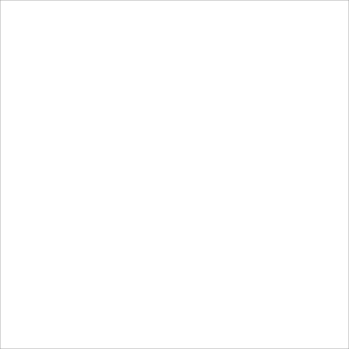
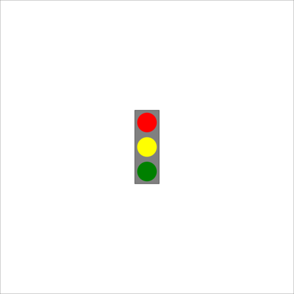
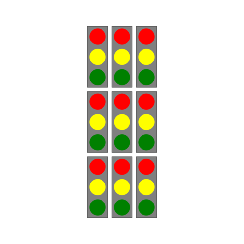

# Introducció
L'objectiu d'aquesta pràctica és familiaritzar-se amb el llenguatge de programació *Haskell*. Els 6 exercicis que formen la pràctica estan orientats a entendre les funcions pures, la recursivitat, les funcions d'ordre superior, etc. En tots ells es fa ús de la biblioteca `Drawing` per produir imatges vectorials.

# Exercicis
Tots els exercicis comencen important la biblioteca `Drawing` i definint el tipus de la funció `main`, així que a partir d'ara no ho destacaré en els comentaris específics de cada exercici.

## Exercici 1
### Comentaris
En aquest exercici no cal programar res, només es demana observar el resultat del codi facilitat a l'enunciat.

Mirant el codi és evident que el resultat serà una imatge buida, ja que simplement s'implementa el dibuix com a `blank`.

### Codi font
```Haskell
module Main where
import Drawing

-- Define the main function to use later.
main :: IO ()

-- Start of ex. 1.
myDrawing :: Drawing
myDrawing = blank

main = svgOf myDrawing
-- End of ex. 1.
```
### Resultat


## Exercici 2
### Comentaris
Aquest exercici demana dibuixar un semàfor centrat a l'origen. També especifica que cal definir i implementar la funció `lightBulb` per dibuixar els llums.

Primer de tot implemento la funció `ligthBulb` (no indico els tipus ja que el compilador ho infereix) que requereix dos paràmetres `c` (color) i `y` (translació en l'eix Y). A partir d'aquests paràmetres la funció dibuixa un cercle de mida 1, desplaçat `y` verticalment i de color `c`.

Un cop implementada la funció per dibuixar les bombetes cal la funció per dibuixar el rectangle. En aquest cas ho faig en dos passos, primer dibuixo el contorn d'un color `c` amb la funció `outline` i a continuació el pinto amb la funció `fill` d'un altre color que també batejo com a `c` (poden ser colors diferents ja que són variables locals). Les mides del rectangle venen donades pel dibuix d'exemple facilitat.

Finalment només queda unir 3 bombetes, 1 contorn i 1 relleu per tenir el semàfor. Això ho faig a la funció `trafficLight` fent una composició de tots aquests elements. Un cop fet, es crida aquesta funció com a paràmetre de `svgOf` per generar la imatge vectorial amb un semàfor.

### Codi font
```Haskell
module Main where
import Drawing

-- Define the main function to use later.
main :: IO ()

-- Start of ex. 2.
-- Implement a function to draw lightbulbs.
lightBulb c y = colored c (translated 0 y (solidCircle 1))

-- Define the rectangle.
x = 2.5
y = 7.5
outline c = colored c (rectangle x y)
fill c = colored c (solidRectangle x y)

-- Join all the elements.
trafficLight = lightBulb red (2.5) <> lightBulb green (-2.5) <> lightBulb yellow 0 <> outline black <> fill gray

main = svgOf trafficLight
-- End of ex. 2.
```

### Resultat


## Exercici 3
### Comentaris
En aquest exercici es demana dibuixar un array de 3x3 semàfors aplicant recursivitat.

A l'enunciat es facilita la funció `lights` que requereix un paràmetre `n` (nombre de semàfors). Aquesta funció dibuixa de forma recursiva una fila de `n` semàfors cridant a la funció `trafficLight` cada cop fins arribar al cas base, que no dibuixa res. Per tal que els semàfors no se solapin cada cop que es crida a si mateixa aplico un desplaçament horitzontal de 3 unitats al resultat.

A continuació, per tal de tenir un *array* cal aplicar aquesta recursivitat verticalment. Això ho faig implementant una nova funció `arrayLights` que requereix dos paràmetres `x` (nombre de columnes) i `y` (nombre de files). De manera ànaloga a com es fa a la funció `lights`, la funció `arrayLights` dibuixa una fila de `x` semàfors utilitzant la funció `lights` i composa això amb el resultat de cridar-se a si mateixa però desplaçat 8 unitats el resultat. Cal destacar que la recursivitat és només sobre la variable `y` ja que si ho féssim sobre `x` a cada fila tindríem menys semàfors.

### Codi font
```Haskell
module Main where
import Drawing

-- Define the main function to use later.
main :: IO ()

-- Implement a function to draw lightbulbs.
lightBulb c y = colored c (translated 0 y (solidCircle 1))

-- Define the rectangle.
x = 2.5
y = 7.5
outline c = colored c (rectangle x y)
fill c = colored c (solidRectangle x y)

-- Join all the elements.
trafficLight = lightBulb red (2.5) <> lightBulb green (-2.5) <> lightBulb yellow 0 <> outline black <> fill gray

-- Start of ex. 3.
lights 0 = blank
lights n = trafficLight <> translated 3 0 (lights (n-1))
arrayLights x 0 = blank
arrayLights x y = lights x <> translated 0 8 (arrayLights x (y-1))

myDrawing x y = translated ((-1.5)*(x-1)) ((-4)*(y-1)) (arrayLights x y)
main = svgOf (myDrawing 3 3)
-- End of ex. 3.
```

### Resultat


## Exercici 4
### Comentaris
Per seguir treballant amb la recursivitat primer de tot es demana dibuixar un arbre (apartat **a**) i a continuació afegir-hi flors (apartat **b**). D'una variant a l'altra només canvia una línia, així que comentaré els dos apartats conjuntament.

Primer de tot, tot i que no és necessari, implemento la funció `branca` que simplement dibuixa un segment que va del (0,0) al (0,1), és a dir, un segment vertical de longitud 1.

A continuació, per dibuixar l'arbre, implemento la funció `arbre` que requereix un paràmetre `n` (nombre de nivells de branques). La funció `arbre` és una funció recursiva que dibuixa una branca i la composa amb el resultat de cridar-se a si mateixa rotada π/10 rad i desplaçada 1 verticalment i de nou composada amb una altra crida a si mateixa però aquest cop rotant -π/10 rad. Aquest doble nivell de recursivitat és necessari per tal de fer que de cada branca en surtin 2.

La diferència entre els apartats **a** i **b** és en la implementació del cas base `arbre 0`. A l'apartat **a** indiques que en arribar a 0 no dibuixi res, en canvi en el cas **b** indiques que dibuixi un cercle groc. El "problema" d'aquest segon cas és que si vols dibuixar un arbre de 0 nivells en lloc de no dibuixar res dibuixarà un cercle groc a l'origen.

### Codi font
```Haskell
module Main where
import Drawing

-- Define the main function to use later.
main :: IO ()

branca = polyline[(0,0),(0,1)]
-- Without flowers
--arbre 0 = blank
-- With flowers
arbre 0 = colored yellow (solidCircle 0.2)
arbre n = branca <> translated 0 1 (rotated (pi/10) (arbre(n-1))) <> translated 0 1 (rotated (-pi/10) (arbre(n-1)))

myDrawing = arbre 8
main = svgOf myDrawing
```

### Resultat


## Exercici 5
### Comentaris
En aquest exercici es demana implementar una funció general `repeatDraw` que espera els paràmetres `thing` i `n` per tal de repetir un dibuix `thing` `n` vegades. En concret, per repetir el dibuix de l'exercici 3. Tot i que l'exercici només demana implementar aquesta funció i la resta de codi te'l facilita l'enunciat, explicaré el seu funcionament.

Primer de tot es defineix la funció `repeatDraw` com una funció que espera un primer paràmetre que sigui una funció que espera un enter i torna un dibuix, un segon paràmetre que siguin un enter i que retorna un dibuix. La implementació és força senzilla: es crida `thing` (recordem que és una funció) i se li passa `n` com a paràmetre (recordem que `thing` espera un enter), això es composa amb la crida de `repeatDraw` a si mateixa.

La funció `light` espera dos paràmetres enters `r` (fila) i `c` (columna). Aquesta funció dibuixa un semàfor a la intersecció entre la fila `r` i la columna `c`. És important destacar l'ús de la funció `fromIntegral` per convertir enters a un tipus de nombre més genèric (p.e. Double).

A continuació s'implementa la funció `lightRow` que com indica el seu nom és per dibuixar files de semàfors. Aquesta funció només espera un paràmetre `r`, el nombre de semàfors que ha de tenir la fila. Aquesta funció fa ús de la funció `repeatDraw` que he implementat abans. Bàsicament el paràmetre `thing` que espera `repeatDraw` és `light r` i `n` és 3, però ep, `light` no requeria dos paràmetres? Efectivament. El segon paràmetre que necessita es passa dins de la funció `repeatDraw`, recordem que `thing` és una funció que espera UN paràmetre enter. Això mateix es pot entendre més fàcilment amb notació Haskell: en passar `light r` a `repeatDraw` tenim: `light r n <> repeatDraw light r (n-1)`, i podem observar que `n` és el paràmetre `c`.

Finalment cal repetir verticalment les files, així que es crida `repeatDraw` sobre `lightRows`.

### Codi font
```Haskell
module Main where
import Drawing

-- Define the main function to use later.
main :: IO ()

-- Implement a function to draw lightbulbs.
lightBulb c y = colored c (translated 0 y (solidCircle 1))

-- Define the rectangle.
x = 2.5
y = 7.5
outline c = colored c (rectangle x y)
fill c = colored c (solidRectangle x y)

-- Join all the elements.
trafficLight = lightBulb red (2.5) <> lightBulb green (-2.5) <> lightBulb yellow 0 <> outline black <> fill gray

-- Start of ex. 5.
repeatDraw :: (Int -> Drawing) -> Int -> Drawing
repeatDraw thing 0 = blank
repeatDraw thing n = thing n <> repeatDraw thing (n-1)

-- Draw a traffic light in the coordinates r,c.
light :: Int -> Int -> Drawing
light r c = translated (3 * fromIntegral c - 6) (8 * fromIntegral r - 16) trafficLight

-- Draw a row of r lights.
lightRow :: Int -> Drawing
lightRow r = repeatDraw (light r) 3
{- How does it work? 
light r is a function that expects a second parameter c. When calling repeatDraw it becomes:
 light r n <> repeatDraw light r (n-1) so we can see that n is used as the c in light.
-}

-- Draw n light rows.
myDrawing n = repeatDraw lightRow n
main = svgOf (myDrawing 3)
-- End of ex. 5.
```

### Resultat
No s'inclou, és idèntic al de l'exercici 3.

## Exercici 6
### Comentaris
A la biblioteca de Haskell ja existeix una funció més general que `repeatDraw` per resoldre aquest problema, la funció `foldMap`. L'exercici demana utilitzar-la per tal de repetir el dibuix de l'exercici 3.

Primer de tot modifico la funció `light` de l'exercici 5 per tal de passar-li nombres reals en lloc d'enters. D'aquesta manera, en lloc d'indicar les coordenades d'una matriu, s'indiquen les coordenades d'un pla.

A continuació implemento la funció `trafficLights` que espera una llista de tuples de nombres reals i retorna un dibuix. El cas base d'aquesta funció (llista buida) és no dibuixar res i en qualsevol altre cas es crida la funció `foldMap` passant-li com a paràmetres la funció `light` i una llista `l`. El que farà `foldMap` serà agafar cada element de la llista `l` (en teoria tuples de nombres reals) i passar-lo com a paràmetre de la funció `light`, generant així un semàfor en cada iteració. Finalment farà un *fold* (composició) de tots els dibuixos retornant un únic dibuix.

### Codi font
```Haskell
module Main where
import Drawing

-- Define the main function to use later.
main :: IO ()

-- Implement a function to draw lightbulbs.
lightBulb c y = colored c (translated 0 y (solidCircle 1))

-- Define the rectangle.
x = 2.5
y = 7.5
outline c = colored c (rectangle x y)
fill c = colored c (solidRectangle x y)

-- Join all the elements.
trafficLight = lightBulb red (2.5) <> lightBulb green (-2.5) <> lightBulb yellow 0 <> outline black <> fill gray

-- Start of ex. 6.
-- Draw a traffic light in the coordinates r,c.
light :: (Double, Double) -> Drawing
light (r,c) = translated (3 * c - 6) (8 * r - 16) trafficLight

-- Using foldMap draw traffic lights in the coordinates in the list.
trafficLights :: [(Double, Double)] -> Drawing
trafficLights [] = blank
trafficLights l = foldMap light l
{- How does it work?
foldMap runs the function light in every element of the list l (Foldable).
The elements of l are coordinates so in every iteration it returns a
Drawing (Monoid) and then it performs a composition of all the Drawings
with the operator <>.
-}

main = svgOf (trafficLights
    [(3.0,1.0),(3.0,2.0),(3.0,3.0),
     (2.0,1.0),(2.0,2.0),(2.0,3.0),
     (1.0,1.0),(1.0,2.0),(1.0,3.0)
    ])
-- End of ex. 6.
```

### Resultat
No s'inclou, és idèntic al de l'exercici 3.
